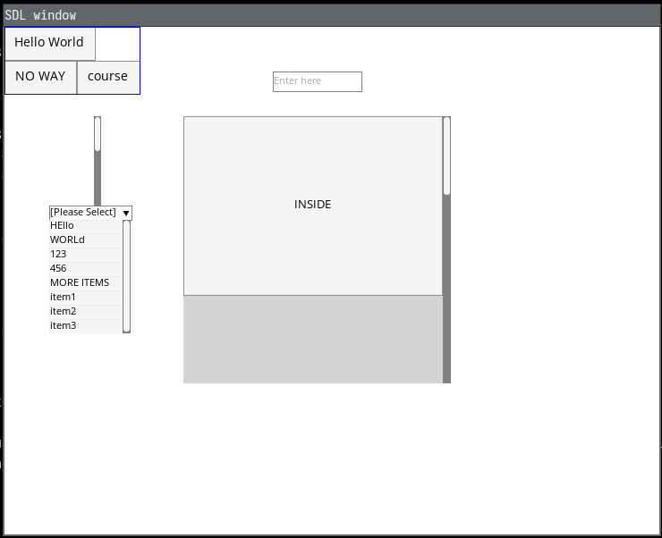

# Vlgui



The general setup looks like this:
```haskell
  -- ...
  let
    org = (Point2 0 0)
    lay = vPure (const (,))
      `vAp`
        ( ofMinSize (buttonMinSize btn1)
        )
      `vAp`
        ( hPure (const (,))
          `hAp` ofMinSize (buttonMinSize btn2)
          `hAp` ofMinSize (buttonMinSize btn3)
        )
    (btn1area, (btn2area, btn3area)) = layoutMinAt org lay
    fullarea = fromOrgSize org (lay^.minimumSize)

  (btn1w, btn1o) <- (guiin, btn1area, btn1) >- dynButton
  (btn2w, btn2o) <- (guiin, btn2area, btn2) >- dynButton
  (btn3w, btn3o) <- (guiin, btn3area, btn3) >- dynButton

  let
    bararea = fromOrgSize (Point2 100 100) (Vector2 commonScrollBarWidth 200)
    bar = ScrollBarCfg { _pageStep = 20, _pageLength = 100 }
  (barw, baro) <- (guiin, bararea, bar) >- dynScrollBarAuto

  -- ...
```
